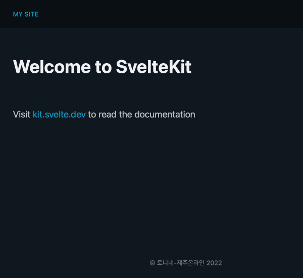

# Sveltekit with Pico CSS

## 1. 시작하기

```bash
$ pnpm create svelte pico-app
$ cd pico-app
$ pnpm add -D pico-css
$ pnpm run dev

# or for production
$ vite build
$ vite preview --host 0.0.0.0
```

## 2. 레이아웃

첫페이지 레이아웃을 만들어보자.



### 1) $src/routes/+layout.svelte

특별히 레이아웃을 생성하지 않으면 비어있는 layout 인 `<slot />`만 적용된다.

- `<slot />`에는 `+page.svelte`의 내용이 들어간다.

```svelte
<script>
	import '@picocss/pico';
</script>

<div id="page">
	<nav class="center">
		<!-- svelte-ignore a11y-missing-attribute -->
		<a>My Site</a>
	</nav>

	<main class="center">
		<slot />
	</main>

	<footer class="center">© 토니네-제주온라인 2022</footer>
</div>

<style>
	:global(html) {
		overflow-y: scroll;
	}

	#page {
		display: flex;
		flex-direction: column;
		min-height: 100vh;
		gap: 5vw;
	}

	.center {
		padding-left: max(1rem, calc(50vw - 350px));
		padding-right: max(1rem, calc(50vw - 350px));
	}

	nav,
	footer {
		text-transform: uppercase;
		font-size: 0.7rem;
		letter-spacing: 0.1px;
	}

	nav {
		background: rgba(0, 0, 0, 0.4);
		font-weight: 500;
		padding-top: 1rem;
		padding-bottom: 1rem;
	}

	footer {
		text-align: center;
		padding: 3rem 0;
		color: #777;
		margin-top: auto;
	}
</style>
```

> vite:import-analysis 의 imports deprecated 경고 메시지 없애기

- `import '@picocss/pico';` 방식으로 변경

```text
import pico from "@picocss/pico";
5  |  import { base } from "$app/paths";
6  |
Default and named imports from CSS files are deprecated.
Use the ?inline query instead.
For example: import pico from "@picocss/pico?inline"
  Plugin: vite:import-analysis
```

### 2) $src/routes/about/+layout.svelte

레이아웃은 계층적으로 적용된다.

- src
  - routes
    - +layout.svelte : 메인 레이아웃
    - +page.svelte : 메인 페이지
    - about
      - +layout.svelte : about 레이아웃
      - +page.svelte : about 페이지

```svelte
<h2>This is Layout of About</h2>

<slot />
```

## 3. [컴포넌트](https://picocss.com/docs/cards.html)

### Layout

- Containers
  - header, main, footer
  - section

### Elelments

- Typography
- Buttons
- Forms
- Tables

### Components

- Accordions
- Cards
- Dropdowns
- Modal
- Navs
- Progress

### Utilities

- Loading
- Tooltips

## 4. 빌드 및 배포

### 1) [Sveltekit Adapters](https://kit.svelte.dev/docs/adapters)

#### `@sveltejs/adapter-auto`

다양한 호스팅 서비스에 배포할 수 있도록 지원한다.

- Cloudflare Pages
- Netlify
- Vercel

#### `@sveltejs/adapter-node`

Node.js 서버에서 배포할 수 있도록 지원한다.

#### `@sveltejs/adapter-static`

정적 사이트를 생성할 수 있도록 지원한다. [SvelteKit.Doc](https://github.com/sveltejs/kit/tree/master/packages/adapter-static)

1. `@sveltejs/adapter-static` 설치
2. `svelte.config.js` 어댑터 변경
3. `src/routes/+layout.ts` SSR 옵션 추가
4. 빌드 `npm run build`
5. build 결과물 확인

> NOTE!!

- prerender 옵션은 반드시 routes 의 최상위 ts 파일에 추가해야 한다.
- SPA mode 는 권장하지 않는다.

```bash
$ npm i -D @sveltejs/adapter-static
# 어댑터 변경
$ vi svelte.config.js
# =================================
// 기본값 import adapter from '@sveltejs/adapter-auto';
import adapter from '@sveltejs/adapter-static';  # 변경
# =================================
# SSR 옵션
$ echo "export const prerender = true;" > src/routes/+layout.ts

$ npm run build
> pico-svelte@0.0.1 build
> vite build

vite v4.0.1 building for production...
✓ 46 modules transformed.
오후 3:28:07 [vite-plugin-svelte] dom compile done.
package         files     time     avg
pico-svelte         6   82.4ms  13.7ms

vite v4.0.1 building SSR bundle for production...
✓ 52 modules transformed.
오후 3:28:07 [vite-plugin-svelte] ssr compile done.
package         files     time    avg
pico-svelte         5   13.1ms  2.6ms
@sveltejs/kit       1    2.6ms  2.6ms
...

$ ls -l build
drwxr-xr-x  4 bgmin  staff   128 12 15 15:28 _app
-rw-r--r--  1 bgmin  staff  2062 12 15 15:28 about.html
-rw-r--r--  1 bgmin  staff  1571 12 15 15:28 favicon.png
-rw-r--r--  1 bgmin  staff  1997 12 15 15:28 index.html
-rw-r--r--  1 bgmin  staff  3882 12 15 15:28 vite-manifest.json
```

### 2) [paths.base 설정](https://kit.svelte.dev/docs/modules#$app-paths-base)

1. `svelte.config.js` 에서 `config.paths.base` 설정
2. `import { base } from '$app/paths';` 로 가져와서
3. `<a href="{base}/">` 사용

```html
<nav class="center">
	<!-- svelte-ignore a11y-missing-attribute -->
	<a href="{base}/">My Site</a>
	<a href="{base}/about">About</a>
</nav>
```
